# PT1-Stage 3: Database Implementation and Indexing

**Team Project:** Shelf Swap

---

## Database Implementation

### Method of Implementation

We used CloudSQL with MySQL 8.0 in Google Cloud Platform (GCP) to implement our Shelf Swap relational schema. Our GCP database models relations such as User, Book, UserCopies, ExchangeRequests, Review, Club, and ClubMembership.

### Proof of Connection

We successfully deployed and verified our database in CloudSQL.

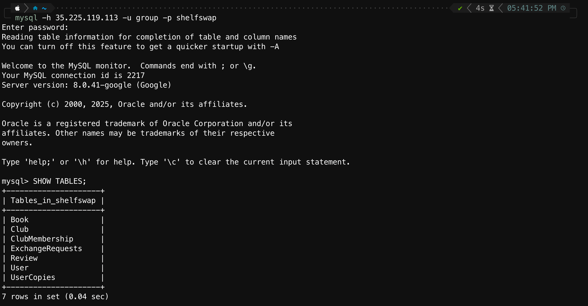

### DDL Commands

**User**
```sql
CREATE TABLE User (
    userID INT PRIMARY KEY AUTO_INCREMENT,
    username VARCHAR(50) NOT NULL UNIQUE,
    email VARCHAR(255) NOT NULL UNIQUE,
    name VARCHAR(100),
    dateJoined DATETIME DEFAULT CURRENT_TIMESTAMP,
    location VARCHAR(100)
);
```
**Book**
```sql
CREATE TABLE Book ( 
bookID INT PRIMARY KEY AUTO_INCREMENT, 
title VARCHAR(255) NOT NULL, 
genre VARCHAR(100), 
author VARCHAR(255), 
publisher VARCHAR(255), 
yearPublished INT, 
averageRating FLOAT, 
isbn VARCHAR(13) UNIQUE );
```

**UserCopies**
```sql
CREATE TABLE UserCopies (
    copyID INT PRIMARY KEY AUTO_INCREMENT,
    userID INT NOT NULL,
    bookID INT,
    `condition` ENUM('New', 'Like New', 'Good', 'Fair', 'Poor') DEFAULT 'Good',
    canExchange BOOLEAN DEFAULT TRUE,
    FOREIGN KEY (userID) REFERENCES User(userID) ON DELETE CASCADE,
    FOREIGN KEY (bookID) REFERENCES Book(bookID) ON DELETE SET NULL
);
```

**ExchangeRequests**
```sql
CREATE TABLE ExchangeRequests (
    requestID INT PRIMARY KEY AUTO_INCREMENT,
    requesterID INT NOT NULL,
    receiverID INT NOT NULL,
    requesterCopyID INT NOT NULL,
    receiverCopyID INT NOT NULL,
    dateCreated DATETIME DEFAULT CURRENT_TIMESTAMP,
    ‘status’ ENUM('Pending', 'Accepted', 'Rejected', 'Completed', 'Cancelled') DEFAULT ‘Pending’,
    dateExchanged DATETIME,
    isReturned BOOLEAN DEFAULT FALSE,
    FOREIGN KEY (requesterID) REFERENCES User(userID) ON DELETE SET NULL,
    FOREIGN KEY (receiverID) REFERENCES User(userID) ON DELETE SET NULL,
    FOREIGN KEY (requesterCopyID) REFERENCES UserCopies(copyID) ON DELETE SET NULL,
    FOREIGN KEY (receiverCopyID) REFERENCES UserCopies(copyID) ON DELETE SET NULL
);
```

**Review**
```sql
CREATE TABLE Review (
    reviewID INT PRIMARY KEY AUTO_INCREMENT,
    userID INT NOT NULL,
    bookID INT NOT NULL,
    rating INT CHECK (rating BETWEEN 1 AND 5),
    reviewDate DATETIME DEFAULT CURRENT_TIMESTAMP,
    FOREIGN KEY (userID) REFERENCES User(userID) ON DELETE CASCADE,
    FOREIGN KEY (bookID) REFERENCES Book(bookID) ON DELETE CASCADE
);
```

**Club**
```sql
CREATE TABLE Club (
    clubID INT PRIMARY KEY AUTO_INCREMENT,
    name VARCHAR(100) NOT NULL,
    dateCreated DATETIME DEFAULT CURRENT_TIMESTAMP,
    memberCount INT DEFAULT 0,
    theme VARCHAR(100),
    privacy ENUM('Public', 'Private', 'InviteOnly') DEFAULT 'Public',
    ownerID INT,
    FOREIGN KEY (ownerID) REFERENCES User(userID) ON DELETE SET NULL

);
```

**ClubMembership**
```sql
CREATE TABLE ClubMembership (
    userID INT,
    clubID INT,
    dateJoined DATETIME DEFAULT CURRENT_TIMESTAMP,
    PRIMARY KEY (userID, clubID),
    FOREIGN KEY (userID) REFERENCES User(userID) ON DELETE CASCADE,
    FOREIGN KEY (clubID) REFERENCES Club(clubID) ON DELETE CASCADE
);
```

### Data Insertion
For the 'Book' table, we inserted data obtained from the following Kaggle dataset: https://www.kaggle.com/datasets/saurabhbagchi/books-dataset/data. For the rest of our tables, we generated data using a Python script. All of our tables contain at least 1000 rows.
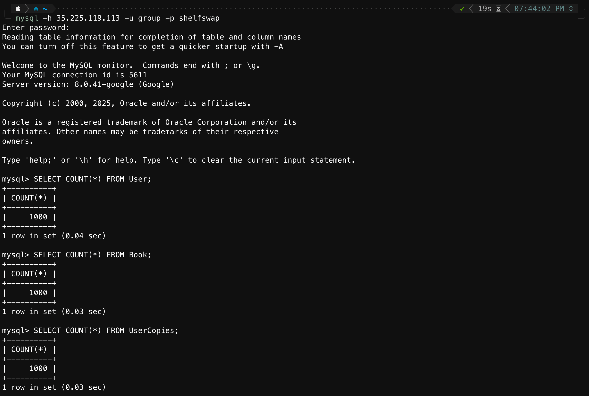

---

## Advanced Queries

### Query 1: Finding the Highest Rated Books in a Given Time Frame (JOIN, GROUP BY)
This query finds the books that have received the highest average rating in a specified time frame (ex. last 90 days). It uses a table join between Book and Review to connect each review to the book it is about. It also groups rows by bookID and title in order to run aggregate functions like count and average. We also factored in popularity (more than 5 reviews) so that a book with only a single 5-star review will not be shown at the top of the list.

```sql
SET @days := 90;

SELECT 
    b.bookID,
    b.title,
    AVG(r.rating) AS avgRating,
    COUNT(r.reviewID) AS totalReviews
FROM Book b
JOIN Review r ON b.bookID = r.bookID
WHERE r.reviewDate >= DATE_SUB(CURRENT_DATE, INTERVAL @days DAY)
GROUP BY b.bookID, b.title
HAVING COUNT(r.reviewID) >= 5
ORDER BY avgRating DESC, totalReviews DESC;
```
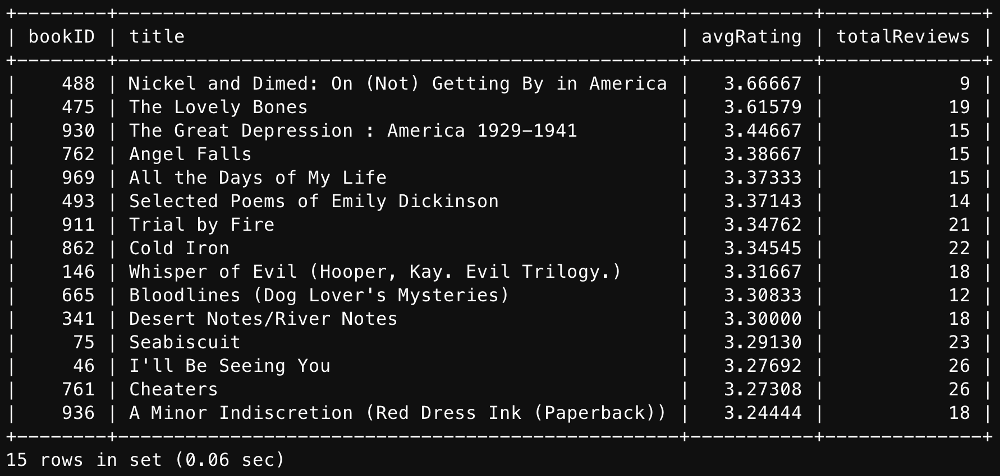

### Query 2: Finding Most Active Clubs Based On User Activity (JOIN, GROUP BY)
This query finds the most active clubs at the time of running the query, where activity is defined by the number of members participating in book exchanges during the last 90 days. It uses a table join between club, club membership, and exchange requests to obtain information on each member's activity level. It also groups by clubID and club name in order to count the number of exchange requests from each member. We also ensure that we are only counting completed exchange requests, as well as dividing total exchanges by the number of members to avoid penalizing small clubs.

```sql
SET @days := 90;

SELECT
    c.clubID,
    c.name AS clubName,
    COUNT(er.requestID) AS recentMemberExchanges
FROM Club c
JOIN ClubMembership cm ON c.clubID = cm.clubID
JOIN ExchangeRequests er 
    ON er.status = 'Completed'
   AND er.dateExchanged >= DATE_SUB(NOW(), INTERVAL @days DAY)
   AND (er.requesterID = cm.userID OR er.receiverID = cm.userID)
GROUP BY c.clubID, c.name
ORDER BY recentMemberExchanges / c.memberCount DESC;
```
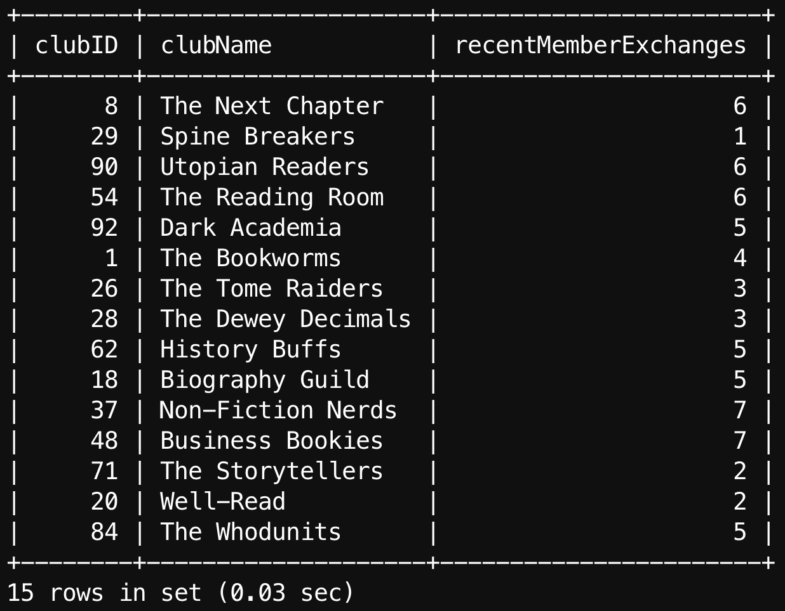

### Query 3: Book Suggestions Based on Personal Ratings (JOIN, GROUP BY, Subqueries)
This query provides book suggestions by recommending books rated highly by other users who liked similar books. Specifically, a user is recommended books they have not read before that are rated highly by users who gave high ratings to the same books as them. The query uses table joins between review and book to connect each review to the book it's about. It also groups by bookID and book title in order to run aggregate functions like count and average. Lastly, a nested subquery is used to find users who enjoyed the same books as the target user, while another subquery is used to find books that have already been read by the target user (for exclusion). We also made sure that there are at least 2 book overlaps between users to avoid coincidental overlaps.

```sql
SET @targetUser := 5;

SELECT 
    b.bookID,
    b.title,
    AVG(r.rating) AS avgRating
FROM Review r
JOIN Book b ON r.bookID = b.bookID
WHERE r.rating >= 4
  AND r.userID IN (
        SELECT DISTINCT r2.userID
        FROM Review r2
        WHERE r2.rating >= 4
          AND r2.bookID IN (
                SELECT bookID 
                FROM Review 
                WHERE userID = @targetUser
                  AND rating >= 4
          )
          AND r2.userID <> @targetUser
    )
  AND b.bookID NOT IN (
        SELECT bookID 
        FROM Review 
        WHERE userID = @targetUser
    )
GROUP BY b.bookID, b.title
HAVING COUNT(r.reviewID) >= 2
ORDER BY avgRating DESC;
```
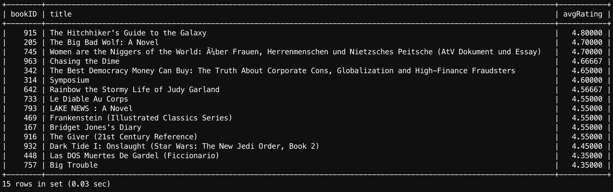

### Query 4: Find Active Local Users Who Like a Certain Genre (JOIN, GROUP BY, Subquery, Union)
This query finds users in the same location as the target user who are active (exchanged in the last 60 days) and like a certain genre (read multiple books in the genre with an average rating above 4). It uses a table join between reviews and books to connect each review to the book it is about. It also groups those reviews by userID so that aggregate functions can be used to see if a user "likes" that genre. Multiple subqueries are used throughout to find user locations, users who like the target genre, and active users. Lastly, a set union is used between requesters and receivers to find users who have participated in book exchanges in the past 60 days. Together, this complex query connects users with local bookworms who have shared interests.

```sql
SET @genre := 'Fiction';
SET @targetUser := 930;
SET @daysActive := 60;

SELECT DISTINCT u.userID, u.username, u.location
FROM User u
WHERE u.location = (
        SELECT location FROM User WHERE userID = @targetUser
    )
  AND u.userID IN (
        SELECT r.userID
        FROM Review r
        JOIN Book b ON r.bookID = b.bookID
        WHERE b.genre = @genre
        GROUP BY r.userID
        HAVING COUNT(*) >= 2 AND AVG(r.rating) >= 4
    )
  AND u.userID IN (
        SELECT requesterID 
        FROM ExchangeRequests
        WHERE dateCreated >= DATE_SUB(NOW(), INTERVAL @daysActive DAY)
        UNION
        SELECT receiverID 
        FROM ExchangeRequests
        WHERE dateCreated >= DATE_SUB(NOW(), INTERVAL @daysActive DAY)
    )
  AND u.userID <> @targetUser;
```
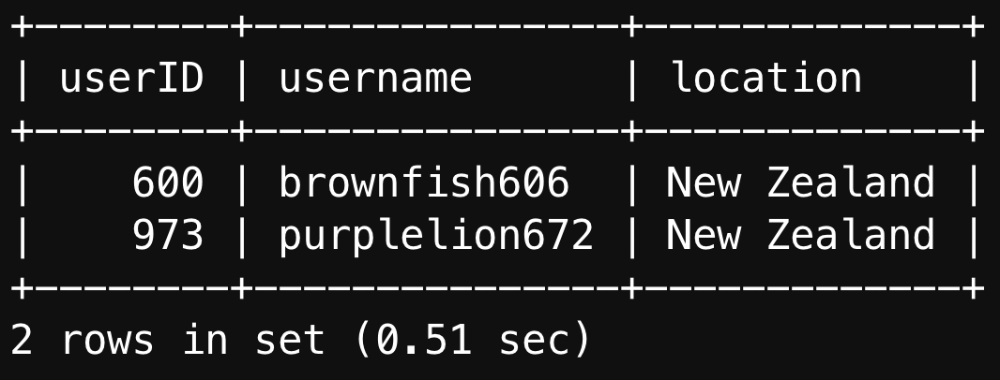

---

## Indexing Analysis

### Query 1

#### No Indexing

Without an indexing strategy, the query had a cost of 3090 due to a full-table scan of the Review table, which has 20000 rows. This is clearly a large bottleneck for query 1, so the following indexing strategies will attempt to address the issue.
    
#### Index Design 1
```sql
CREATE INDEX idx_review_date ON Review(reviewDate);
```
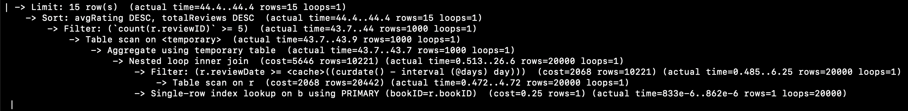
This indexing strategy uses an index on ReviewDate in hopes of speeding up the scan on the Review table, specifically in the WHERE clause. However, it actually increased the cost to 5646, which is an 82% increase. From the results, it can be seen that a full table scan on Review was done anyway. This is because all 20000 entries in Review matched the "last 90 days" filter, meaning the optimizer determined that a table scan was more efficient than 20000 individual table lookups.

#### Index Design 2
```sql
CREATE INDEX idx_review_date_bookid ON Review(reviewDate, bookID);
```
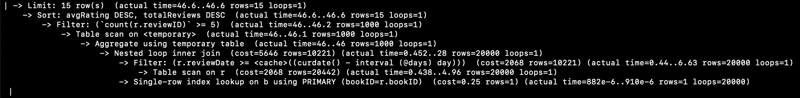
This indexing strategy uses a composite index on ReviewDate and bookID. However, it increased the cost to 5646 (similar to index design 1), which is an 82% increase. From the results, it can be seen that the full table scan on Review was done yet again, meaning the optimizer ignored the indexing. The cause for this is similar to the previous index design, as the table scan was more efficient than looking up entries based on reviewDate. 

#### Index Design 3
```sql
CREATE INDEX idx_q1_cover ON Review(bookID, reviewDate, rating, reviewID);
```
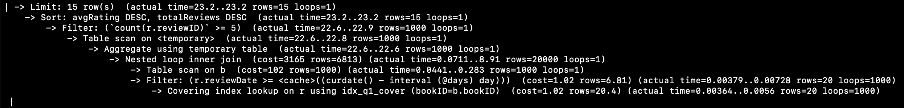
This indexing strategy uses a covering index on bookID, reviewDate, rating, and reviewID, which aims for an overall speedup by indexing all necessary data and avoiding interacting with the main table. This strategy slightly increased the cost to 3165, which is about a 2% increase. As we can see from the analysis, the query now scans through the Book table and then filters results, unlike before (filter results, then scan through Review table). By scanning through the much smaller Book table and using the index to retrieve information about reviews, we are able to avoid the very large table scan. However, since the other tables are very small, the overhead of having an index likely bumped the cost up a bit.

#### Best Design
The best indexing strategy for query 1 is clearly no index, which allowed for the query to avoid the overhead of indexing elements despite needing to fully scan through the very large Review table anyway. Even if we index attributes in Review, ReviewDate being unselective (all reviews were in the past 90 days) made it difficult to justify the use of simple indexes like in designs 1 and 2. Even the covering index in design 3 was unnecessary since we would be indexing a very small book table. Therefore, the optimal solution is just to avoid indexing since we can do all the necessary scans without the unnecessary overhead for the index.

### Query 2

#### No Indexing
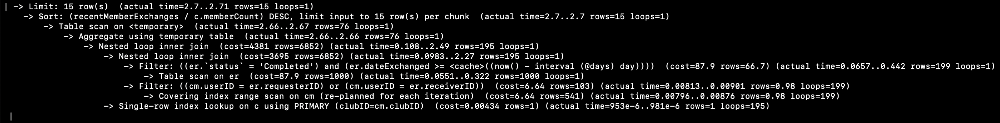
Without an indexing strategy, the query had a cost of 4381. From the analysis, we can see that the inner loops included a table scan on ExchangeRequests, an index range scan on ClubMembership, and lookups on clubID. Since all three of these tables are very small (1000 or fewer elements), these actions are very cheap to perform.
    
#### Index Design 1
```sql
CREATE INDEX idx_er_status_date ON ExchangeRequests(status, dateExchanged);
```
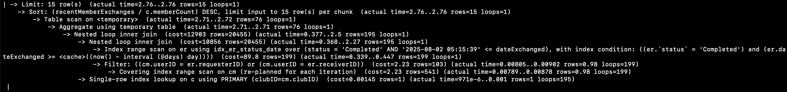
This indexing strategy uses a composite index on status and dateExchanged in ExchangeRequests in an attempt to speed up the comparison in the WHERE clause. However, it actually increased the cost to 12903, which is a 194% increase. From the results, the optimizer now does an index range scan on ExchangeRequests rather than a full table scan, while the scans for the other two tables remained the same. However, the index range scan had a higher cost than the full table scan, which explains why the cost increased overall. Since ExchangeRequests is such a small table, it makes no sense to read an index and then fetch rows, as scanning through 1000 rows comes out to a significantly lower cost in the long run. This strategy did not account for the small size of ExchangeRequests.

#### Index Design 2
```sql
CREATE INDEX idx_er_requester ON ExchangeRequests(requesterID);
CREATE INDEX idx_er_receiver ON ExchangeRequests(receiverID);
```
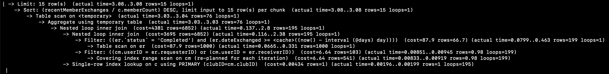
This indexing strategy uses two separate indexes on requesterID and receiverID to speed up the union operation. However, the cost remained at 4381. From the results, it can be seen that the same scans as the "no indexing" design were done again, meaning the optimizer ignored our index design. The cause for this is similar to the index designs for query 1, as the optimizer determined that the full table scan for ExchangeRequests was more efficient than looking up two indexes and merging them. 

#### Index Design 3
```sql
CREATE INDEX idx_er_req_status_date ON ExchangeRequests(requesterID, status, dateExchanged);
CREATE INDEX idx_er_rec_status_date ON ExchangeRequests(receiverID, status, dateExchanged);
```

This indexing strategy uses two separate composite indexes on requesterID, receiverID, status, and dateExchanged to try and combine both of the previous strategies. However, the cost remained at 4381. From the results, it can be seen that the same scans as the "no indexing" design were done again, meaning the optimizer ignored our index design. The cause for this is similar to the index design 2, as the optimizer determined that the full table scan for ExchangeRequests was more efficient than looking up two indexes and merging them.

#### Best Design
The best indexing strategy for query 2 is clearly no index, which allowed for the query to avoid the overhead of indexing elements and to just scan through a small ExchangeRequests table. Even if we index attributes in ExchangeRequests, ExchangeRequests being so small made it difficult to justify the use of composite or multiple indexes, like in our index designs. Most indexes would be ignored by the optimizer in favor of efficiency, if not greatly increasing cost. Therefore, the optimal solution is just to avoid indexing since we can do all the necessary scans without the unnecessary overhead for the index.

### Query 3

#### No Indexing
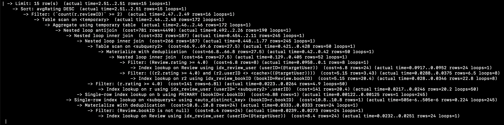
Without an indexing strategy, the query had a cost of 781. From the analysis, we can see that there are many inner loops due to the complexity of this query. For example, there were table scans on subqueries, index lookups on primary keys, index lookups on subqueries, and more. One of the big bottlenecks is that this query involves the table Review, which we have already established to be very large (20000 rows).
    
#### Index Design 1
```sql
CREATE INDEX idx_review_rating ON Review(rating);
```
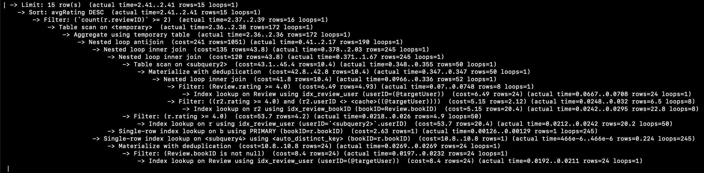
This indexing strategy uses a simple index on rating in Review in an attempt to speed up the processes involving Review. This was a great success, as it decreased the cost to 241, which is a 69% decrease. From the results, the optimizer still does the same operations as without indexing, but the cost for all of these operations has been cut down by around 30% each. While no explicit scan using this index was done, the ability for all the other operations to use index lookups with rating helped decrease their costs. By using an index on a non-selective attribute of the very large Review table, we successfully decreased the cost.

#### Index Design 2
```sql
CREATE INDEX idx_review_user_rating ON Review(userID, rating);
```
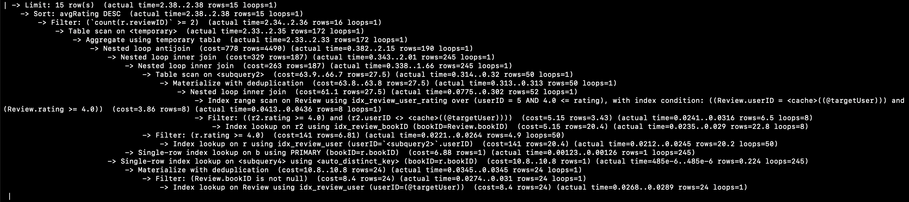
This indexing strategy uses a composite index on userID and rating in Review in an attempt to speed up the processes involving Review further by including more information. This was kind of a success, as it decreased the cost to 778, which is a 0.38% decrease. From the results, the optimizer uses this index in a range scan to look for users with userID 5 and a rating of 4.0 or greater on any of their reviews. While this operation was sped up compared to before, the other operations seemed to have slowed down, which evened out the cost to around the original. Although the cost was decreased slightly, our previous strategy was still better.

#### Index Design 3
```sql
CREATE INDEX idx_review_user_book_rating ON Review(userID, bookID, rating);
```
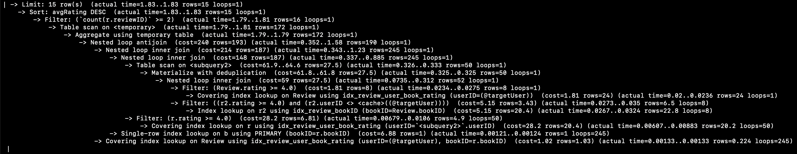
This indexing strategy uses a covering index encompassing all necessary attributes in Review, which are userID, bookID, and rating, in an attempt to mitigate having to return to the main table for more information after an index lookup. This strategy was successful as it decreased the cost to 240, which is a 69% decrease. In the output, we see that the optimizer now does a covering index lookup on the Review table, which allowed it to get all data without returning to the table, as intended. The cost of this design is slightly lower than design 1, and it most likely results from the fact that design 1 still has to return to the table to obtain data.

#### Best Design
The best indexing strategy for query 2 is clearly design 3, which allowed for the query to avoid scanning through the entire Review table or returning to the table after an index lookup. Without indexing the table, large table scans greatly increase costs, while other indexing strategies increase costs by forcing a return to the main table after an index lookup. However, a covering index is able to avoid all of these issues and boost performance the most by encompassing all necessary information into one index.

### Query 4

#### No Indexing
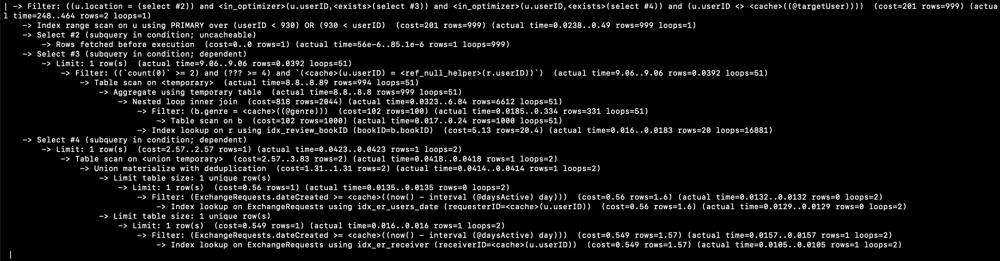
Without an indexing strategy, the query had a cost of 818. From the analysis, we can see that the inner loops included a table scan on the Book table, which is a very small table. Therefore, this operation is very cheap and efficient. Most of the other operations are also very cheap, as they mainly revolve around index lookups based on primary keys.
    
#### Index Design 1
```sql
CREATE INDEX idx_user_location ON User(location);
CREATE INDEX idx_book_genre ON Book(genre);
CREATE INDEX idx_er_req_date ON ExchangeRequests(requesterID, dateCreated);
CREATE INDEX idx_er_rec_date ON ExchangeRequests(receiverID, dateCreated);
```
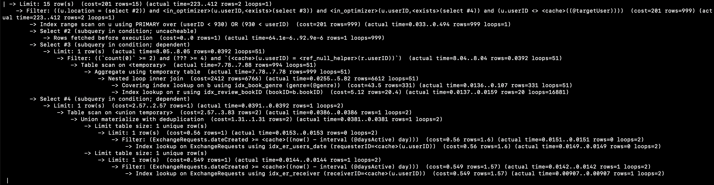
This indexing strategy uses multiple indexes, including two composite indexes in User, Book, and ExchangeRequests, in an attempt to speed up lookup operations for all 3 tables. However, it actually increased the cost to 2412, which is a 194% increase. From the results, the optimizer now does an index range scan on Book rather than a full table scan, while most other operations remained the same. While the index range scan had a lower cost, the overhead of having an index for such a small table increased the cost greatly.

#### Index Design 2
```sql
CREATE INDEX idx_book_genre_id ON Book(genre, bookID); 
CREATE INDEX idx_review_user_rating ON Review(bookID, userID, rating);
```

This indexing strategy uses two composite indexes in Book and Review, in an attempt to speed up table scans for Review, a very large table. However, it actually increased the cost to 1052, which is a 28% increase. From the results, the optimizer now does two covering index lookups instead of 1, which is most likely the reason for the increased cost. The original index lookup became a covering index lookup, which increased the cost a decent bit. We also run into similar issues as before, where we are indexing a small table.

#### Index Design 3
```sql
CREATE INDEX idx_user_location ON User(location);
CREATE INDEX idx_er_req_date ON ExchangeRequests(requesterID, dateCreated);
CREATE INDEX idx_er_rec_date ON ExchangeRequests(receiverID, dateCreated);
CREATE INDEX idx_book_genre_id ON Book(genre, bookID); 
CREATE INDEX idx_review_user_rating ON Review(bookID, userID, rating);
```
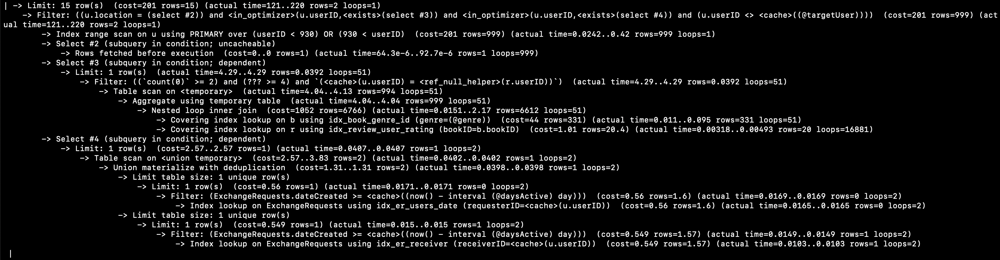
This indexing strategy uses many composite and covering indexes in User, ExchangeRequests, Book, and Review, to try and achieve speedup through indexing all necessary information. However, it actually increased the cost to 1052, which is a 28% increase. From the results, the optimizer now does two covering index lookups instead of 1, which is most likely the reason for the increased cost. It also ignored the other indexes we implemented, which means the optimizer did not think that these index scans would be more efficient than the original table scans.
#### Best Design
The best indexing strategy for query 4 is clearly no index, which allowed for the query to avoid the overhead of indexing elements and to just scan small tables instead. Even if we index attributes in Review, having all reviews be in the last 90 days meant that the attribute was unselective and made it hard to index. Other tables being so small also made it difficult to justify the use of composite or multiple indexes, like in our index designs. Most indexes would be ignored by the optimizer in favor of efficiency, if not greatly increasing cost. Therefore, the optimal solution is just to avoid indexing since we can do all the necessary scans without the unnecessary overhead for the index.

### Table Summary
| Query | No Index | Index Design 1 | Index Design 2 | Index Design 3 | Best Strategy |
|------|---------:|--------------:|--------------:|--------------:|--------------|
| Q1 | 3090 | 5646 | 5646 | 3165 | No Index |
| Q2 | 4381 | 12903 | 4381 | 4381 | No Index |
| Q3 | 781 | 241 | 778 | 240 | Index Design 3 |
| Q4 | 818 | 2412 | 1052 | 1052 | No Index |
---

## Conclusion
Through the use of Google Cloud Platform, we successfully implemented our relational schema into CloudSQL by creating the tables and inserting data. We also came up with four advanced queries with practical use in the application (ex. finding the most active clubs). However, when trying to incorporate index strategies, we learned that many of them were not effective simply due to the fact that our queries were not complex enough and that our tables were too small. Additionally, our only "bottleneck" table, Review, which was mainly used to check for reviews in the past 90 days (queries 1, 3, 4), could not achieve speed-ups through indexing, as all our review data was from the past 90 days, making it more efficient to avoid the overhead of an index and scan the whole table anyways. This meant that the only table worth indexing could not be indexed. As a result, none of our index designs worked out too well, besides the ones for query 3 (a relatively complex query and the only one to not involve filtering for the past 90 days, coincidence?). I believe that if we added much more data to our tables, many of our index designs would actually achieve speedup. Otherwise, indexes are ineffective primarily due to low selectivity and small table sizes, meaning sequential table scans were faster than index lookups.
